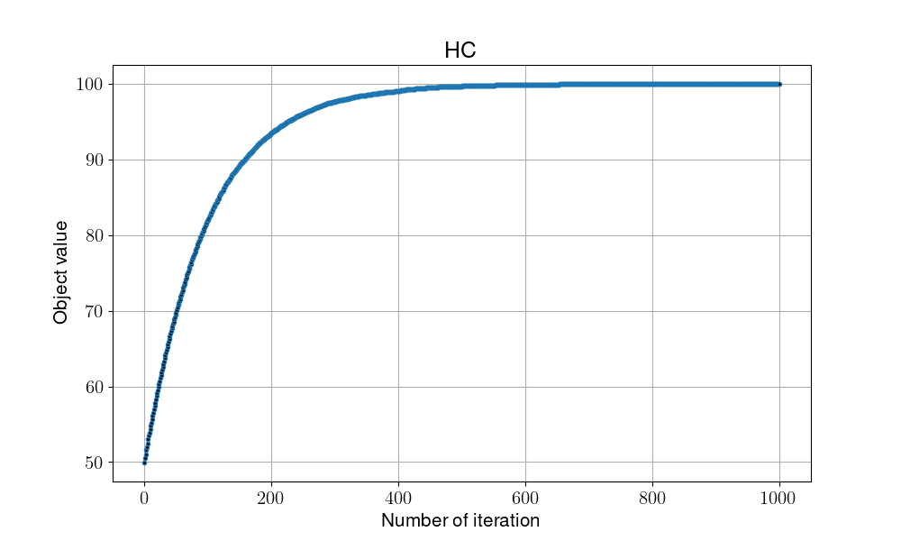
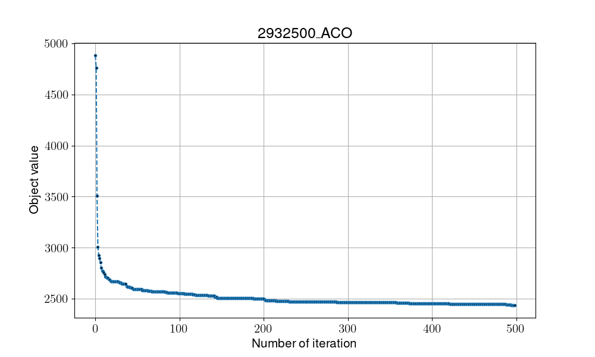
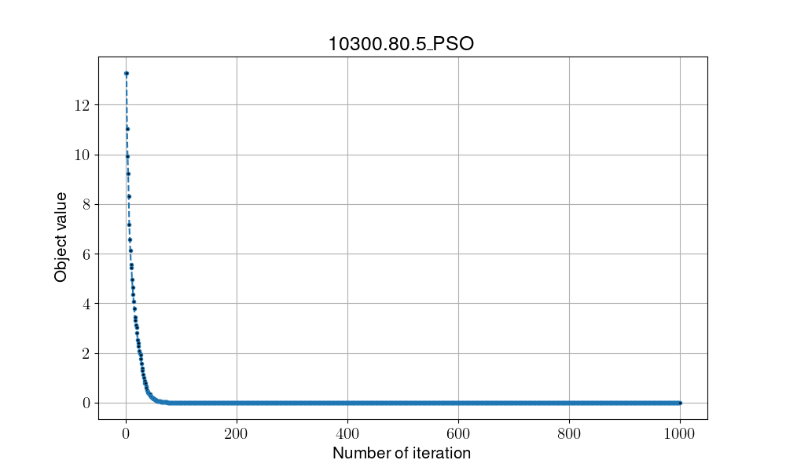

# Metaheuristic

## Parameter setting

1. Number of iterations:
    - Single-solution problem: 1000 iterations
    - Populaiotn-based problem: 1000 evaluations
2. Runs: 50 (average results)
3. Question definition:
    - Single-solution problem: 01-max problem(100bits)
    - Populaiotn-based problem: TSP datasets

## Results

- Exhaust Search

- Hill Climbing

- Stimulated Annealing

- Tabu Search

- Genetic Algorithm

- Ant Colony Optimization

- Particle Swarm Optimization

