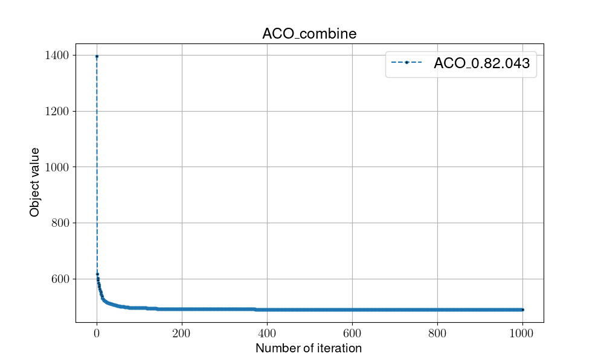
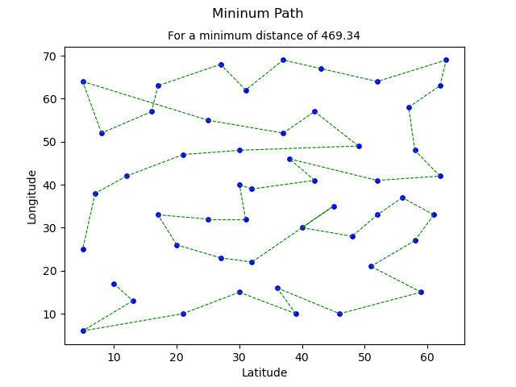
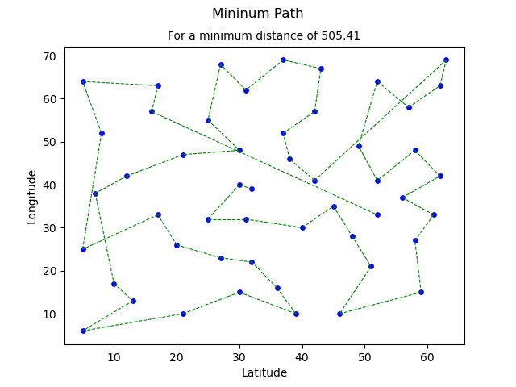

# Ant Colony Optimization

## Overview

Ant Colony Optimization, a population-based approach, generates several solutions in every evaluation and introduces pheromone as well as pheromone update mechanism. Inspired from the habit from the foraging behavior of some ant species.

- pros:
    1. Reach more solution diversity
    2. Efficiently solve Traveling-salesmen-problem(TSP) (NP-hard)

## Pseduocode

```shell
#(I)Initialization
Randomly initialize solution s, 
Randomly generate pheromone matrix p,
Fetch data from TSP test data(distance matrix), d
Local_fitness = Global_fitness = Fitness(s) 

while not met termination condition:

    #(T)Transition
    s = solution_construction(p, d);
    p = pheromone_update(p, s)
    
    #(E)Evaluaiton
    Local_fitness = Fitness(s)

    #(D)Determination
    if Local_fitness < Global_fitness:
        Global_fitness = Local_fitness

return Global_fitness
```

- Solution construction
  - Encoding: Every solution encoded by visited order, and it aims to cover all the nodes in the minimal distance cost. Except the first solution, other evaluations construct the solution by two key factor(**Pheromone and distance matrices**)
  - SolutionUpdate: Alike to ant's foraging behavior, they are more likely to choose most pheromone concentration path

- Pheromone Update
  - After creating ant solution in evey evaluation, the algorithm will collect the edge that mostly visited by observing the pheromone concentration. Pheromone matrix keeps the updated values and served as a prerequisition for the next evaluation.

## Flowchart


## Instructions for running on local machine

1. packages used in this projects:

    - numpy==1.24.2
    - matplotlib==3.7.1

2. Execution

    ```shell
    #python -m Algorithm.ACO [Evaporate Rate][Q][alpha][beta]
    python -m Algorithm.GA 0.8 2.0 4 3
    ```

3. Folder organiation

    - Each algorithm will generate two files:
        - {filename}.png: show the trend/process of certain algo.
        - {filename}.csv: record every global optimal in every iterations
    - Check all the result in [**result**](../result/) folder
        
    - Visualization of solution(path)
        
        

4. Discussion
    - Since Traveling salesmen problem(TSP) is NP-hard problem, most traditional algorithms cannot provide an efficient way to solve it. However, meta-heuristic algorithm provide an efficient approach that implement solution construction mechanism (Breadth-first search) as well as pheromone update mechanism (depth-first-search).

    - However, ant colony optimization(ACO) required a lot of hyperprameter fine tunning, such as evaporate rate, Q, alpha, beta, etc.
