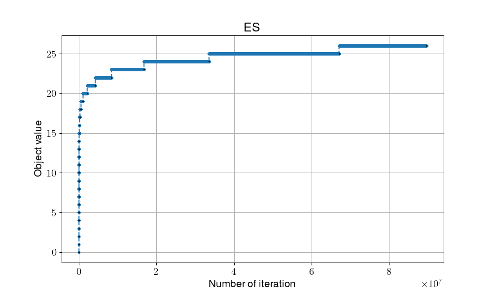

# Exhausive search

## Overview

Exhausive search, a brutal way to traverse all the possible solution by incremental method, in order to gain the optimal solution.

- pros:
    1. Easy to understand/ implement

- cons:
    1. Waste a lot of computing resource
    2. Unable to reach the opimal soluiton when number getting large

## Pseduocode

```shell
#(I)Initialization
count = 0 #[0,0,...,0.0,0]
Local_fitness = Global_fitness = Fitness(count)

while not met termination condition:

    #(T)Transition
    count += 1
    Neghbor(count) = p #[0,0,...,0,0,1]

    #(E)Evaluaiton
    Local_fitness = Fitness(p)

    #(D)Determination
    if Local_fitness > Global_fitness:
        Global_fitness = Local_fitness

return GLobal_fitness
```

- Transition: find next solution (neighbor solution) by incremental method
- Evaluation: count the number of 1 bits in the solution
- Determination: compare with global optimal, update if it gain better evaluation

## Flowchart


## Instructions for running on local machine

1. packages used in this projects:

    - numpy==1.24.2
    - matplotlib==3.7.1
    - pandas==1.5.3

2. Execution

    ```shell
    python -m Algorithm.ES
    ```

3. Folder organiation

    - Each algorithm will generate two files:
        - {filename}.png: show the trend/process of certain algo.
        - {filename}.csv: record every global optimal in every iterations
    - Check all the result in [**result**](../result/) folder
    - 
