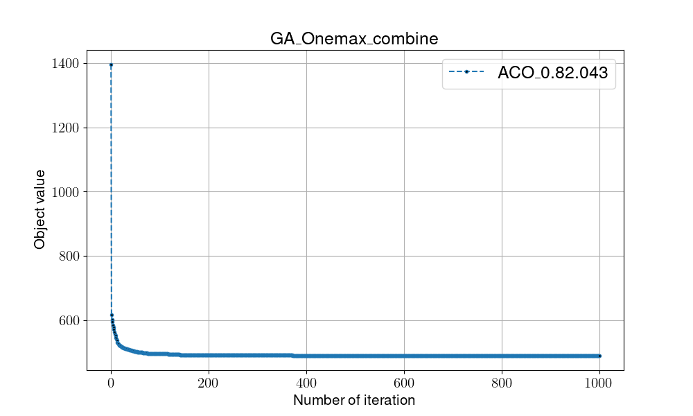

# Genetic Algorithm

## Overview

Genetic algorithm, a population-based approach, generates several  solutions in every evaluation and iterates answers by transitions composed of three operators(selection, crossover, mutation) that are inspired from Charles Darwin's Theory of Evolution.

- pros:
    1. Reach more solution diversity

- cons:
    1. lots of hyperparameter(selection method, crossover method, mutation ways) to fine tuning

## Pseduocode

```shell
#(I)Initialization
Random initialize v
Local_fitness = Global_fitness = Fitness(v) 

while not met termination condition:

    #(T)Transition
    s = Selection(v) 
    c = Crossover(s) 
    m = Mutation(c) 
    
    #(E)Evaluaiton
    Local_fitness = Fitness(m)
    v = update_solution(m)

    #(D)Determination
    if Local_fitness > Global_fitness:
        Global_fitness = Local_fitness

return Global_fitness
```

- Transition: three operators

  - Selection:
    - Roulette wheel: pick by the probability proportional to its fitness values
    - Tournament tour: pick the top players in every evaluation
    - Eliste:always pick the largest value
  - Crossover:
    - Onepoint: randomly pick one bit in solution, split it into two parts, the front and back. Shift the front part with another solution.
    - Twopoint: randomly pick two bits in solution, split it into three parts, the front, middle and back. Shift the middle part with another solution.
  - Mutation: generate random value and compare to mutate rate, mutate while the random value is smaller than the mutate rate. Mutate is randomly pick one bit of the solution and shift it.

- Evaluation: count the number of 1 bits in the solution
- Determination: compare with global optimal, update if it gain better evaluation

## Flowchart


## Instructions for running on local machine

1. packages used in this projects:

    - numpy==1.24.2
    - matplotlib==3.7.1

2. Execution

    ```shell
    #python -m Algorithm.GA [crossover rate][mutation rate][population size][selection size]
    python -m Algorithm.GA 0.9 0.3 1000 100
    ```

3. Folder organiation

    - Each algorithm will generate two files:
        - {filename}.png: show the trend/process of certain algo.
        - {filename}.csv: record every global optimal in every iterations
    - Check all the result in [**result**](../result/) folder
    - 

4. Discussion
    - Different from the previous discussed algorithm approaches, the genetic algorithm computes multiple solution cases in every evaluation. In the other word, it expands the diversity of solution searching, and coverage via the selection method in transition.
    - Ideally, the roulette wheel method in big proportion picks the better fitness solutions, while at the same time keeps the small proportion for less performance solutions.
    - Result shows the average optimal solution after 1000 evaluations is approximately 90 bits.Three operators in genetic algorithms largely affect the computing process.
    - In this case, 100 bits onemax problem, I regard every bit as a switch with two options for each and set the selection size to 100 for the sum of the total switches. And the other hyperparameters were set randomly by experimental testing.

    - In the future, there is still lots of work to do, including fine-tuning hyperparameters such as crossover rate, mutation rate.  Additionally, adopting different methods of selection plays a vital role in the transition part of this algorithm.
