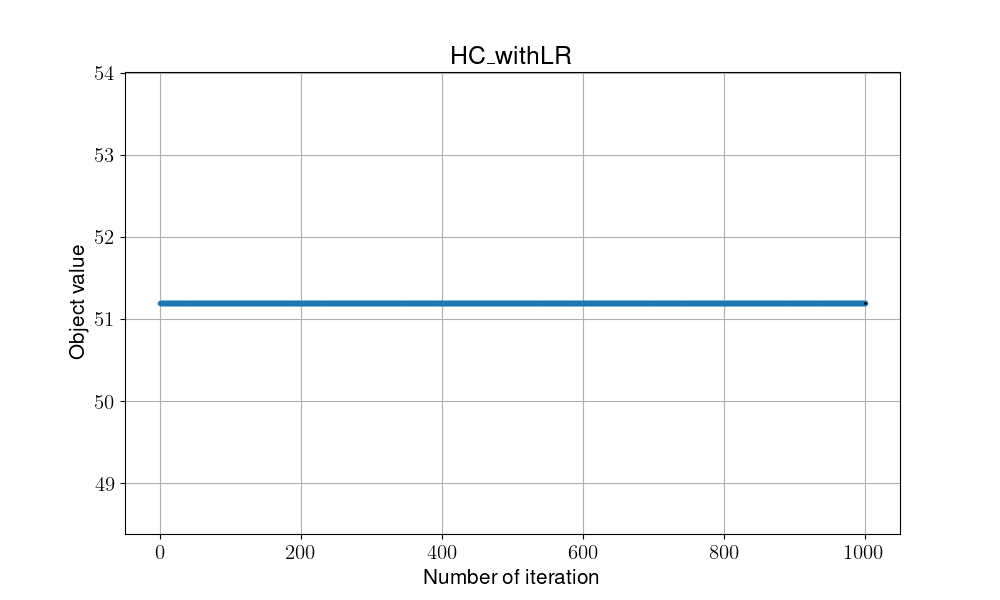
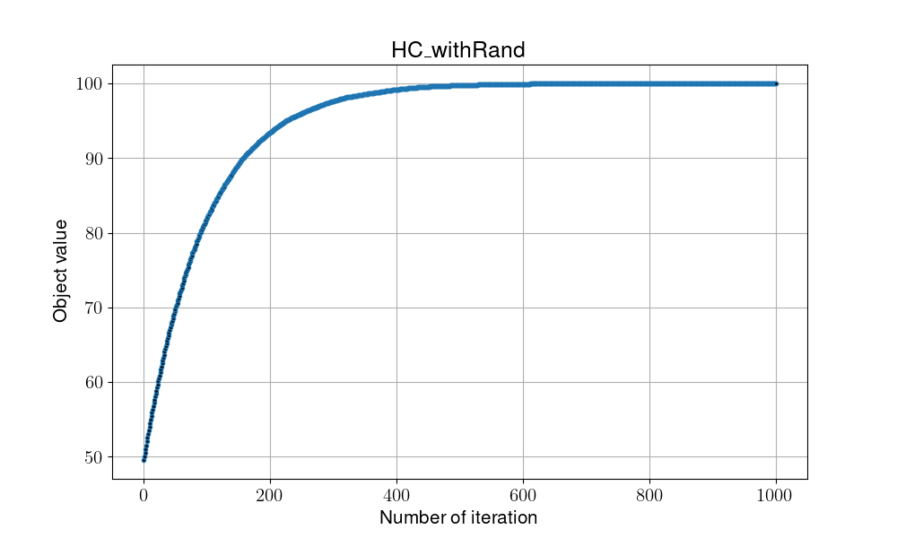

# Hill Climbing

## Overview

Hill Climbing, modify the selection of picking neighbor solution by adding slightly movement compared to the current solution, in order to gain the optimal solution.

- pros:
    1. Time efficient

- cons:
    1. Might caught into local optimal

## Pseduocode

```shell
#(I)Initialization
Random initialize v
Local_fitness = Global_fitness = Fitness(v) 

while not met termination condition:

    #(T)Transition
    NeghborSolution(v) = p

    #(E)Evaluaiton
    Local_fitness = Fitness(p)

    #(D)Determination
    if Local_fitness > Global_fitness:
        Global_fitness = Local_fitness

return Global_fitness
```

- Transition: find next solution (neighbor solution) by only modify one bits in the solution (add slightly movement), we provide two modes to operate:
  - LR: Modify by either chose to increament of descerasement direction
  - Rand: Randomly pick one bit in the string and modify it (1->0 or 0->1)

- Evaluation: count the number of 1 bits in the solution
- Determination: compare with global optimal, update if it gain better evaluation

## Flowchart


## Instructions for running on local machine

1. packages used in this projects:

    - numpy==1.24.2
    - matplotlib==3.7.1
    - pandas==1.5.3

2. Execution

    ```shell
    python -m Algorithm.HC {mode}
    # mode = Rand | LR
    ```

3. Folder organiation

    - Each algorithm will generate two files:
        - {filename}.png: show the trend/process of certain algo.
        - {filename}.csv: record every global optimal in every iterations
    - Check all the result in [**result**](../result/) folder
    - 
    - 
