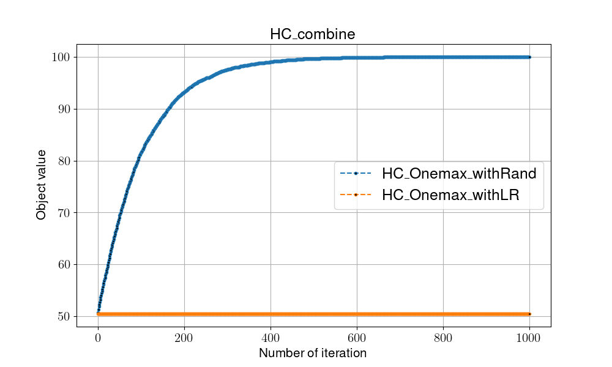

# Hill Climbing

## Overview

Hill Climbing, modify the selection of picking neighbor solution by adding slightly movement compared to the current solution, in order to gain the optimal solution.

- pros:
    1. Time efficient

- cons:
    1. Might caught into local optimal

## Pseduocode

```shell
#(I)Initialization
Random initialize v
Local_fitness = Global_fitness = Fitness(v) 

while not met termination condition:

    #(T)Transition
    NeghborSolution(v) = p

    #(E)Evaluaiton
    Local_fitness = Fitness(p)

    #(D)Determination
    if Local_fitness > Global_fitness:
        Global_fitness = Local_fitness

return Global_fitness
```

- Transition: find next solution (neighbor solution) by only modify one bit in the solution (add slightly movement), we provide two modes to operate:
  - LR: Modify by either increment or decrement direction against to recent solution
  - Rand: Randomly pick one bit in the string and modify it (1->0 or 0->1)

- Evaluation: count the number of 1 bits in the solution
- Determination: compare with global optimal, update if it gain better evaluation

## Flowchart


## Instructions for running on local machine

1. packages used in this projects:

    - numpy==1.24.2
    - matplotlib==3.7.1

2. Execution

    ```shell
    python -m Algorithm.HC
    # program will run through two mode(includeing "Rand" and "LR")
    ```

3. Folder organiation

    - Each algorithm will generate two files:
        - {filename}.png: show the trend/process of certain algo.
        - {filename}.csv: record every global optimal in every iterations
    - Check all the result in [**result**](../result/) folder
        
        - Global optimal solution(average from 51 runs):
            - withLR: **51.2 bits**
            - withRand: **100 bits**

4. Dissusion (Two approachs in transition)
    - with LR:

        since in every iteration you can either choose two directions at random against its current solution, it is more easily caught into the local optimal. (example: when current is “00010”, I can only choose “00011” or “00001”) Moreover, from the perspective of distribution in this 100 bits one-max problem, roughly 50 bits account the most. Though, we randomly start in every run, the final result of 51 runs, the average result is 51.2.

    - with Rand:

        Different from the method of “LR”, “Rand” provides a more global(wide) search approach to reach a better solution (example: when current is “00010”, I can have 5 options “10010” “01010” “00110” “00000” “00011”), and update the answer when it gains a better evaluation.
