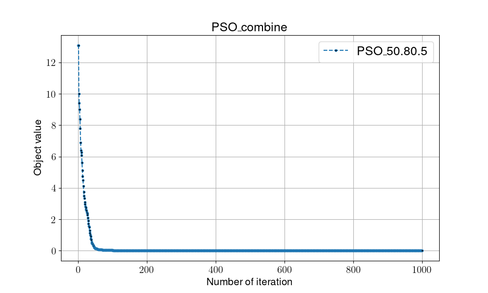

# Particle Swarm Optimization

## Overview

Particle Swarm Optimization, a population-based approach, generates several solutions in every evaluation and intended for simulating social behaviour, as a stylized representation of the movement of organisms in a bird flock or fish school. The algorithm was simplified and it was observed to be performing optimization.(cited from [Wikipedia](https://en.wikipedia.org/wiki/Particle_swarm_optimization))

## Pseduocode

```shell
#(I)Initialization
Initialize position s & velocities v of all particles
Initialize the personal best of particles pb and global best gb 


while not met termination condition:

    #(T)Transition
    v_{t+1} = new_velocity(s_{t},v_{t},pb_{t},gb_{t})
    s_{t+1} = new_position(s_{t}, v_{t+1})
    
    #(E)Evaluaiton
    pb = update_velocity(s_{t+1})
    gb = update_position(v_{t+1})
    Local_fitness = argmin(pb)

    #(D)Determination
    if Local_fitness < Global_fitness:
        Global_fitness = Local_fitness

return Global_fitness
```

## Flowchart


## Instructions for running on local machine

1. packages used in this projects:

    - numpy==1.24.2
    - matplotlib==3.7.1

2. Execution

    ```shell
    #python -m Algorithm.PSO [Dimension][a1][a2]
    python -m Algorithm.PSO 0.8 2.0 4 3
    ```

3. Folder organiation

    - Each algorithm will generate two files:
        - {filename}.png: show the trend/process of certain algo.
        - {filename}.csv: record every global optimal in every iterations
    - Check all the result in [**result**](../result/) folder
        

4. Discussion
