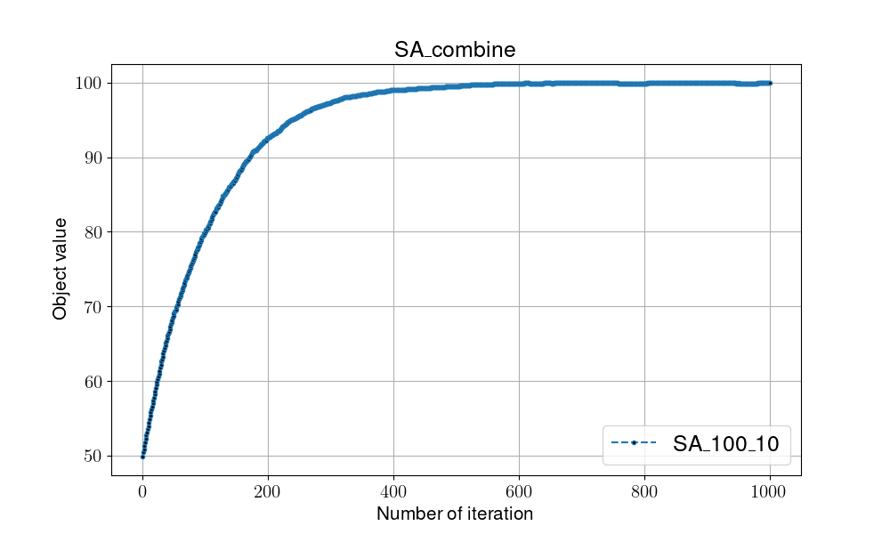
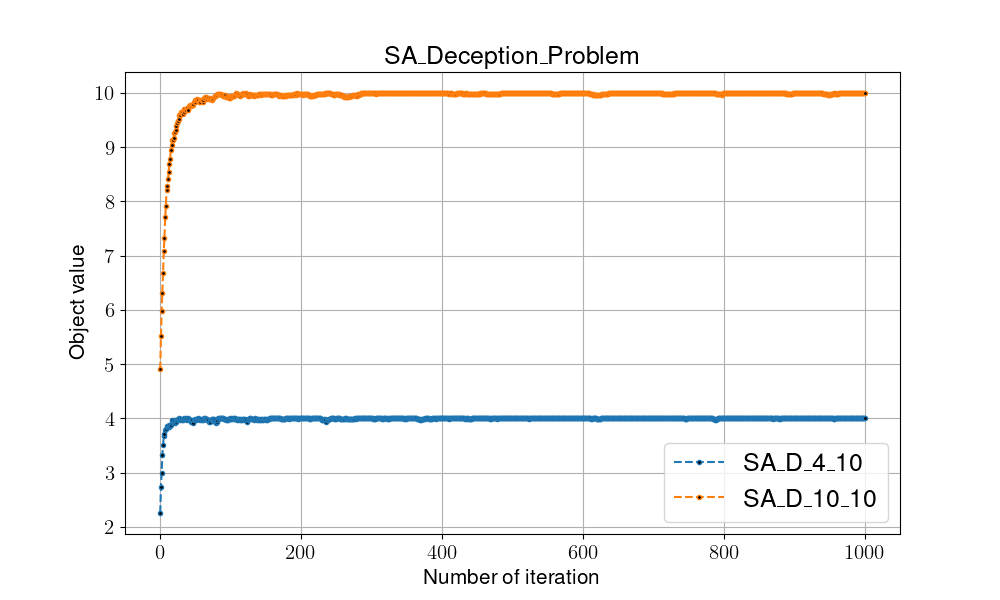

# Simulated Annealing

## Overview

Simulated Annealing(SA), similiar to [Hill Climibing](./HC.md) (pick neighbor solution by adding slightly movement). The difference is determination part, SA compute a acceptance probability (based on current temperature).

In every iteration, SA accept the solution in two conditions: whether the one with better fitness value or random value is smaller than acceptance probability.

The acceptance probability is given by the Boltzmann distribution: exp(-delta/T), where delta is the difference in value between the current and neighbor solutions, and T is the current temperature.


- pros:
    1. Time efficient

- cons:
    1. Might caught into local optimal

## Pseduocode

```shell
#(I)Initialization
Random initialize v
Local_fitness = Global_fitness = Fitness(v) 

while not met termination condition:

    #(T)Transition
    NeghborSolution(v) = p

    #(E)Evaluaiton
    Local_fitness = Fitness(p)

    #(D)Determination
    if Local_fitness > Global_fitness:
        Global_fitness = Local_fitness
    # Annealing process
    else random_value < acceptance_prob:
        Global_fitness = Local_fitness
        Update temperature

return Global_fitness
```

- Transition: find next solution (neighbor solution) by only randomly modify one bits in the solution (add slightly movement)
- Evaluation:
  - One-max problem: count the number of 1 bits in the solution
  - Preceptive problem: count the number of consistence bits against to ground truth (randomly generate once)
- Determination:
  - Phase one: compare with global optimal, update global optimal solution if it gain better evaluation or a random value is smaller than acceptance probability
  - Phase two: **introducing annealing mechanism**, update global optimal solution if the random generate value is smaller than the acceptance probability. Then, update the temperature everytime when the global optimal solution update in phase two.

## Flowchart



## Instructions for running on local machine

1. packages used in this projects:

    - numpy==1.24.2
    - matplotlib==3.7.1

2. Run code

    ```shell
    # One-max problem 
    python -m Algorithm.SA 10 # sys.argv[1]: temperature

    # Preception problem
    python -m Algorithm.SA_D 10 # sys.argv[1]: temperature

    ```

3. Folder organiation

    - Each algorithm will generate two files:
        - {filename}.png: show the trend/process of certain algo.
        - {filename}.csv: record every global optimal in every iterations
    - Check all the result in [**result**](../result/) folder
       Algo. name |Problem definition| Initial temperature | Delta temperature per update | Global Optimal
        :----|:----:|:----:|:----:|:----:
        [Hill Climbing](../result/Deception_Problem(HC%20vs%20SA).png)|Preception n=4 |10| 0.95 | 4
        [Hill Climbing](../result/Deception_Problem(HC%20vs%20SA).png)|Preception n=10 |10| 0.95 | 10
        [Simulated Annealing](../result/SA_100_10.csv)| One-max 100bits |10| 0.95 | 100 bits
        [Simulated Annealing](../result/SA_D_4_10.csv)| Preception n=4 |10| 0.95 | 4
        [Simulated Annealing](../result/SA_D_10_10.csv)| Preception n=10 |10| 0.95 | 10

        
        
        **Zoom in for details**
        .png)

4. Dissusion
    - Simulated annealing(SA) improve the ability of global search by intorducing annealing process, and less likely to caught into local optimal (as hill climbing might be).

    - From the figure below. In deception problem, We found that with the increasement in n, SA shows more effective than HC. The possible reason might be the annealing process in SA, it optimize the proccess of wide search.
        .png)
