# Tabu Search

## Overview

Tabu Search, introduce the idea of tabu-list that reduce picking repeat solution in every iterations, in order to gain the optimal solution.

- pros:
    1. Reach more soluiton diversity
    2. Avoid continuously searching same solution

- cons:
    1. Might caught into local optimal
    2. Tabulist size varies to different question

## Pseduocode

```shell
#(I)Initialization
Random initialize v
Local_fitness = Global_fitness = Fitness(v) 

while not met termination condition:

    #(T)Transition
    NeghborSolution(v) = p
    # Tabu-list mechanism
    while p in Tabulist:
        NeghborSolution(v) = p
    Update_tabulist(p)

    #(E)Evaluaiton
    Local_fitness = Fitness(p)

    #(D)Determination
    if Local_fitness > Global_fitness:
        Global_fitness = Local_fitness

return Global_fitness
```

- Transition: find next solution (neighbor solution) by only modify one bits in the solution (add slightly movement) and check whether the solution is in tabulist(regenerate a solution when there the solution duplicate)
- Evaluation: count the number of 1 bits in the solution
- Determination: compare with global optimal, update if it gain better evaluation

## Flowchart



## Instructions for running on local machine

1. packages used in this projects:

    - numpy==1.24.2
    - matplotlib==3.7.1
    - pandas==1.5.3

2. Run code

    ```shell
    # sys.argv[1]: tabulist size
    python -m Algorithm.TS 20
    ```

3. Folder organiation

    - Each algorithm will generate two files:
        - {filename}.png: show the trend/process of certain algo.
        - {filename}.csv: record every global optimal in every iterations
    - Check all the result in [**result**](../result/) folder
    - 
